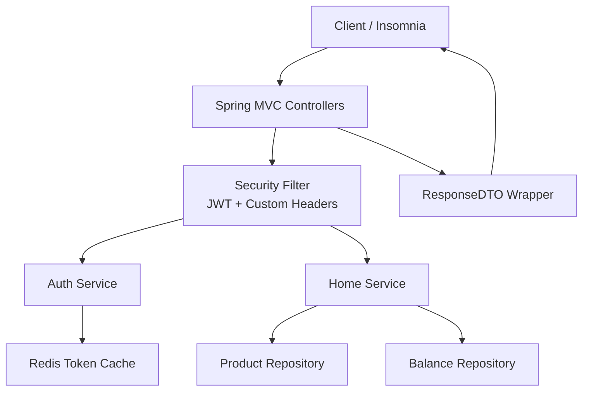

**Here is the complete, updated Phase 1 ERD** — ready to copy into your repository.

---

**Engineering Requirements Document (ERD)**  
**corebank-monolith**  
**Phase 1 – Legacy Monolith**

**Document Version:** 1.1  
**Last Updated:** May 04, 2026  
**Status:** Active  
**Project Series:** CoreBank Modernization Journey

---

### 1. Executive Summary

The `corebank-monolith` is a single **Spring Boot 4.0.6** Java 21 application that simulates a realistic **legacy banking backend** as it exists in many financial institutions today.

It implements two core banking domains in one tightly coupled application:
- **Authentication** (login + JWT + custom banking headers)
- **Homepage / Product Aggregation** (accounts, cards, balances)

**Purpose of this Phase**: Create a deliberately imperfect starting point with classic technical debt (mixed concerns, blocking I/O, layered architecture) that will be modernized in later phases.

**Key Characteristics**
- Classic layered architecture with intentional anti-patterns
- Synchronous blocking operations (Spring MVC)
- Custom Davivienda-style banking headers
- Standardized `ResponseDTO` wrapper
- Minimum **80%** test coverage (JaCoCo)
- Current tooling (Spring Boot 4.0.6 + Java 21 + Gradle Kotlin DSL)

---

### 2. System Overview

**Purpose**  
Provide functional authentication and aggregated homepage data while reflecting real legacy banking constraints.

**Business Capabilities**
- Client authentication with JWT and banking headers
- Aggregated product & balance information for authenticated clients

**Non-Functional Goals**
- 80%+ test coverage
- Production-like logging and observability
- Easy migration path for Phase 2

---

### 3. Architecture

**Architecture Style**  
Classic **Layered Architecture** (intentionally not clean) — this is the “before” picture of the modernization journey.



**High-Level Flow Explanation**  
Requests enter through Spring MVC controllers. A security filter validates JWT and enriches banking headers. The Home Service aggregates data synchronously from repositories.

---

### 4. Technical Stack

| Category       | Technology                    | Version      | Purpose                          |
|----------------|-------------------------------|--------------|----------------------------------|
| Language       | Java                          | 21           | Primary language                 |
| Framework      | Spring Boot                   | **4.0.6**    | Application framework            |
| Web            | Spring MVC (blocking)         | -            | Legacy-style REST                |
| Security       | Spring Security + JJWT        | 0.12.6+      | JWT + custom headers             |
| Database       | PostgreSQL + Spring Data JPA  | -            | Persistent storage               |
| Cache          | Redis                         | -            | Token caching                    |
| Build Tool     | Gradle (Kotlin DSL)           | 8.13+        | Build automation                 |
| Test           | JUnit 5 + Mockito + JaCoCo    | -            | Unit tests + coverage            |
| Observability  | Spring Boot Actuator          | -            | Health & metrics                 |

**Main Starters**:
- `spring-boot-starter-web`
- `spring-boot-starter-data-jpa`
- `spring-boot-starter-data-redis`
- `spring-boot-starter-security`
- `spring-boot-starter-actuator`
- `spring-boot-starter-validation`
- `spring-boot-starter-test`
- Lombok

---

### 5. Domain Capabilities

**Authentication Domain**
- Login with document number / password (mock)
- JWT generation + custom claims
- Banking header enrichment

**Homepage / Product Domain**
- Aggregated view of accounts, cards, and balances
- Synchronous data retrieval

---

### 6. API Endpoints

**Base URL**: `http://localhost:8080`

| Endpoint              | Method | Description                              | Required Headers                          | Response     |
|-----------------------|--------|------------------------------------------|-------------------------------------------|--------------|
| `/api/auth/login`     | POST   | Authenticate + issue JWT                 | `X-CustIdentNum`, `X-CustIdentType`       | `ResponseDTO`|
| `/api/home/balance`   | GET    | Aggregated homepage data                 | All banking headers + `Authorization`     | `ResponseDTO`|
| `/actuator/health`    | GET    | Health check                             | -                                         | `{"status":"UP"}` |

**Response Format**
```json
{
  "statusCode": 200,
  "body": { ... },
  "extraArgs": { ... }
}
```

---

### 7. How to Run the Project (Local Development)

From the project root directory, run:

```bash
docker compose up -d
```

This starts:
- **PostgreSQL** on `localhost:5432`  
  Database: `corebank`  
  User: `postgres`  
  Password: `password`
- **Redis** on `localhost:6379`

#### 7.1. Build the Application

```bash
./gradlew clean build
```

#### 7.2. Run the Spring Boot Application

**Option A – Recommended (Development mode)**

```bash
./gradlew bootRun
```

**Option B – Using executable JAR**

```bash
java -jar build/libs/corebank-monolith-0.0.1-SNAPSHOT.jar
```

The application will be available at **http://localhost:8080**.

---

#### 7.3. How to Stop the Project

```bash
# 1. Stop the Spring Boot application
#    → Press Ctrl+C if running with ./gradlew bootRun

# 2. Stop Docker infrastructure
docker compose down
```

**Optional – Full reset (removes all data)**

```bash
docker compose down -v
```

**Quick verification after startup**

```bash
# Health check
curl http://localhost:8080/actuator/health

# Or open in browser: http://localhost:8080/actuator/health
```
---

### 8. Security

- JWT authentication with custom claims
- `OncePerRequestFilter` for token validation and header injection
- All business endpoints require valid JWT

---

### 9. Infrastructure & Deployment

- Multi-stage Dockerfile (Amazon Corretto 21)
- `docker-compose.yml` with PostgreSQL + Redis
- Local run: `docker compose up --build`

---

### 10. Testing

**Coverage Target**: ≥ 80% (JaCoCo enforced)

**Commands**:
```bash
./gradlew clean build
./gradlew jacocoTestReport
```

---

### 11. What This System Does

- Authenticates clients using JWT + banking headers
- Returns aggregated homepage data
- Demonstrates real legacy banking patterns

### 12. What This System Does NOT Do

- Does **not** use Hexagonal Architecture
- Does **not** use reactive programming
- Does **not** have microservices separation
- Does **not** implement resilience patterns

---

### 13. Development Guidelines

- Java 21 + Gradle Kotlin DSL
- Classic layered structure (Controller → Service → Repository)
- All business logic must have unit tests
- Run `./gradlew build` before committing
- Target 80%+ coverage

---

### 14. Monitoring & Observability

- Spring Boot Actuator
- Structured logging
- Redis monitoring for token cache

---

**End of Phase 1 ERD**

This document is the official baseline for the **CoreBank Modernization Journey**.

---